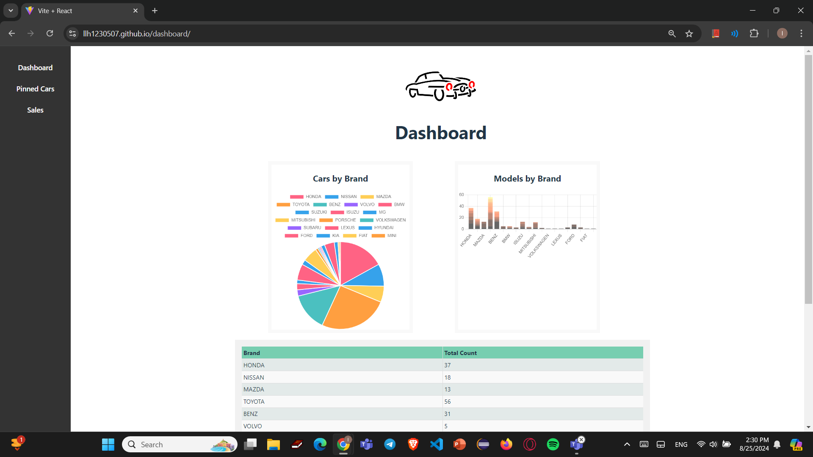

# Project01 Car Analytics
 Name: LeangHour Ly
 ID 6530342

 <h1>1. Dashboard</h1>
 

This is the dashboard page of the owner. It consists of the table, barchart and piechart. There are also the sidebar that consists of 3 pages. The Dashboard is a page of tables and charts that stores and displays the data of the cars from the json file.
For the piechart it consists of cars by brands dividing into slices with Toyota has the most cars with 56 cars and 5 brands with the least with only 1 car. While the stack barchart shows the number of cars each brand has and how many series each brand has. Finally, the table just like both charts illustrates the total number of cars each brand has and it also expand when clicking on the brand which shows the series of the cars each brand has and how many cars as well as the price of it.

<h1>2. Pinned Car</h1>

This is the highlightedcar page. This page allows owner to pin the car to the top of the page and this will help to sale out the car. Furthermore, the page consists of available cars align 4 cars in a row and when pinned the car can be removed. Each slot has a picture and name of the car and when the car is being pinned the slot also shows the price and the year of the car.

<h1>3. Sales Report</h1>

This is the sales car. This page has a table that shows which car brand has been sold and number of the cars being sold.

